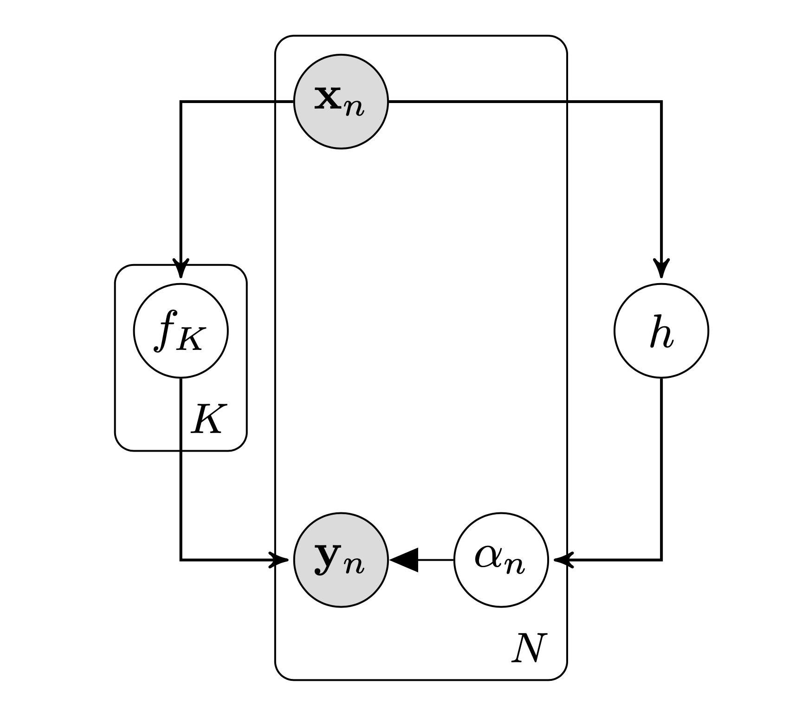

We present an approach for jointly modelling and separating regimes with low and high noise variances in Gaussian process models. 
We assume that our data is generated by two underlying processes with Gaussian noise added from one of two modes, where the noise in one mode is much larger compared to the other. 
Our model separates these two regimes using a Riemannian manifold which we parameterise as a Gaussian process with a sqaured exponential kernel. 
As such, we are able to specify a prior distribution over this *seperation* manifold, providing a mechanism for encoding our expert domain knowledge regarding the separation of the two regimes in the input space. 
It also quantifies the epistemic uncertainty associated with the manifold.

{}

## Problem Statement
In this work we consider dynamical systems,

\begin{equation}
    \mathbf{s}_t = f(\mathbf{s}\_{t-1}, \mathbf{a}\_{t-1}),
\end{equation}

with continuous states $\mathbf{s} \in \mathbb{R}^D$ and actions $\mathbf{a} \in \mathbb{R}^F$ and unknown nonlinear transition dynamics $f$. We assume that the transition dynamics $f$ consists of two regimes $\{f\_1, f\_2\}$,

\begin{equation}
    f = \begin{cases}
      f_1 + \epsilon\_1,\ \text{if}\ h < 0 \newline
      f_2 + \epsilon\_2,\ \text{if}\ h > 0
    \end{cases}
\end{equation}
where $\epsilon\_i \sim \mathcal{N}(0, \Sigma\_{i})$ and $\epsilon\_1 \ll \epsilon\_2$ i.e. the noise in one mode is much larger compared to the other. 
Here we have represented the seperation manifold as $h$.



## Our Model
For notational conciseness we will denote an individual input $(\mathbf{s}\_{t-1}, \mathbf{a}\_{t-1})$ as $\mathbf{x} \in \mathbb{R}^{D+F}$ and its corresponding output $\mathbf{s}\_t$ as $\mathbf{y} \in \mathbb{R}^{D}$. 
Our proposed model assumes that $K=2$ latent functions $\mathbf{f}=\\{f_1, f_2 \\}$ generates $N$ pairs of observations with Gaussian noise added from one of the two modes, resulting in the data set $\mathcal{D} = \\{(\mathbf{x}\_n, \mathbf{y}\_n)\\}\_{n=1}^N$. 
The assignment of the $n^{\text{th}}$ data point is specified by the variable $\alpha_n \in \\{0, 1 \\}$. 
The model assumes that an implicit Riemannian manifold $h$ parameterised as a Gaussian processs separates the two regimes. 
The output of $h$ determines the assignment $\alpha\_n$ by passing its output through the probit function. The figure below shows the graphical model of the generative process.

We denote all of the $N$ inputs $\mathbf{X} = \[\mathbf{x}\_1, ..., \mathbf{x}\_N\]$, all of the targets $\mathbf{Y} = [\mathbf{y}\_1, ..., \mathbf{y}\_N]$ and all of the assignments $\pmb{\alpha} = \\{ \alpha\_1, ..., \alpha\_N \\}$. 
The value of the $k^{th}$ latent function $f\_k$ associated with the $n^{\text{th}}$ input is denoted as $\mathbf{f}^{(k)}\_n = f_k(\mathbf{x}\_n)$ and collected into $\mathbf{f}^{(k)} = \\{ \mathbf{f}^{(k)}\_1,...,\mathbf{f}^{(k)}\_N \\}$ for all data points.
We then collect the latent functions as $\mathbf{F} = [ \mathbf{f}^{(1)}, \mathbf{f}^{(2)} ]$.
Similarly for the latent function $h$ the values $\mathbf{h}\_n = h(\mathbf{x}\_n)$ are collected as $\mathbf{h} = \\{ \mathbf{h}\_1,...,\mathbf{h}\_N \\}$. The likelihood of our model takes the form,
\begin{equation}
	p(\mathbf{Y} | \mathbf{F}, \pmb{\alpha}) = {\displaystyle \prod\_{n=1}^{N}} \mathcal{N}	(\mathbf{y}\_n| \mathbf{f}^{(1)}\_n, \epsilon\_1)^{\alpha\_n} \mathcal{N}	(\mathbf{y}\_n| \mathbf{f}^{(2)}\_n, \epsilon\_2)^{1 - \alpha_n},
\end{equation}
and we place GP priors on the latent functions $\mathbf{F}$,
\begin{equation}
	p(\mathbf{F} | \mathbf{X}) = \prod^K\_{k=1} \mathcal{N}(\mathbf{f}^{(k)}|\mathbf{0}, k^{(k)}({\mathbf{X},\mathbf{X}})),
\end{equation}
where $k^{(k)}(\cdot, \cdot)$ represents the squared exponential kernel with automatic relevance determination.

We assume that there is a relationship between our assignments $\alpha\_n$ and the input space $\mathbf{x}$ such that we can separate the assignments according to an implicit Riemannian manifold. Placing a GP prior on this manifold means that we can encode our prior knowledge of the associations by the choice of mean function. Our prior on the manifold takes the form,
\begin{equation}
	p(h | \mathbf{X}) \sim \mathcal{N}(h | \mu\_h(\mathbf{X}), k\_h(\mathbf{X}, \mathbf{X}))
\end{equation}
where $\mu\_h(\cdot)$ represents the manifolds mean function and $k\_h(\cdot, \cdot)$ represents the manifolds covariance function.
<!-- The output from the GP modelling the separation manifold needs to be constrained $\alpha_n \in [0, 1]$ and thus we define, -->
<!-- \begin{equation} -->
<!-- 	p(\pmb{\alpha} | h) = \text{probit}(h). -->
<!-- \end{equation} -->
The full joint distribution of our model thus takes the form,
\begin{equation}
p(\mathbf{Y}, \mathbf{F}, \pmb{\alpha}, \mathbf{h}, \mathbf{X}) = p(\mathbf{Y} | \mathbf{F}, \pmb{\alpha}) p( \mathbf{F}| \mathbf{X}) p(\pmb{\alpha} |  \mathbf{h}) p(\mathbf{h} | \mathbf{X}) p(\mathbf{X}) .
\end{equation}

### What are we trying to achieve?
We are interested in learning the hyper-parameters of the dynamics GPs $\mathbf{F}$ and the separation manifold GP $h$, as well as the noise variances for each mode $\epsilon\_1, \epsilon\_2$.
We then wish to make predictions of the assignment $\pmb{\alpha}$ for a new input $\mathbf{x}\_\*$ and then select the relevant "mode" (currently defined by noise) and use it to predict $\mathbf{y}\_\*$.  

## Variational Approximation
Exact inference in our model is intractable and thus we require an approximation. We can compute a closed form Jensen's lower bound after expanding the GP priors using auxiliary inducing variables. As introduced in \cite{Damianou2015}, we can use these extra variables in the spare GP framework from \cite{Titsias2009}.

Suppose we have some observations $\mathcal{D}$ generated from a family of models $p(\mathcal{D}, \mathbf{\Theta})$, where $\mathbf{\Theta}$ represents the unknown random variables that the model depends on.

We seek to maximise the logarithm of the marginal likelihood (or evidence) $p(\mathcal{D})$,

$$
\begin{align}
	\text{log}\ p(\mathcal{D}) &= \text{log} \int p(\mathcal{D}, \mathbf{\Theta}) \text{d}\mathbf{\Theta} = \text{log} \int p(\mathcal{D} | \mathbf{\Theta}) p(\mathbf{\Theta}) \text{d}\mathbf{\Theta}.
\end{align}
$$
This provides automatic Occam's razor, penalising complex models and preventing overfitting. This integral is not always tractable and thus variational approaches are required. Variational approaches seek to lower bound the marginal likelihood (or evidence) $p(\mathcal{D})$ using a functional that depends on variational parameters $q(\mathbf{\Theta})$.

$$
\begin{align}
	\text{log}\ p(\mathcal{D}) &= \text{log} \int p(\mathcal{D}, \mathbf{\Theta}) \text{d}\mathbf{\Theta} = \text{log} \int p(\mathcal{D} | \mathbf{\Theta}) p(\mathbf{\Theta}) \text{d}\mathbf{\Theta} \newline
	&= \text{log} \int \frac{q(\mathbf{\Theta})}{q(\mathbf{\Theta})} p(\mathcal{D}, \mathbf{\Theta}) \text{d}\mathbf{\Theta} \newline
	&= \text{log} \int q(\mathbf{\Theta}) \frac{p(\mathcal{D}, \mathbf{\Theta})}{q(\mathbf{\Theta})} \text{d}\mathbf{\Theta} \newline
	&= \text{log} \mathbb{E}\_{q(\mathbf{\Theta})} \bigg[ \frac{p(\mathcal{D}, \mathbf{\Theta})}{q(\mathbf{\Theta})} \bigg] \newline
	&\geq \mathbb{E}\_{q(\mathbf{\Theta})} \bigg[ \text{log} \frac{p(\mathcal{D}, \mathbf{\Theta})}{q(\mathbf{\Theta})} \bigg]
\end{align}
$$

The bound becomes exact if $q(\mathbf{\Theta}) = p(\mathbf{\Theta} | \mathcal{D})$. The true posterior is intractable but the variational posterior $q(\mathbf{\Theta})$ must be constrained (so that it is tractable). It is common to factorise $q(\mathbf{\Theta})$ with respect to groups of elements belonging to parameter set $\mathbf{\Theta}$, this is known as mean field approximation.

### Standard Mean Field Bayesian Inference in Our Model
A Bayesian treatment of our model requires the unknown random variables to be marginalised out: both the mapping values $\mathbf{F}$ and $\mathbf{H}$.
The integral we require is,

$$
\begin{align}
	\text{log}\ p(\mathbf{Y} | \mathbf{X}) &= \text{log} \int p(\mathbf{Y}, \mathbf{F}, \mathbf{H}, \pmb{\alpha} | \mathbf{X}) \text{d} \mathbf{F} \text{d} \mathbf{H} \text{d}\pmb{\alpha}
	\newline
	&= \text{log} \int  p(\mathbf{Y} | \mathbf{F}, \pmb{\alpha}) p(\mathbf{F} | \mathbf{X}) p(\pmb{\alpha} | \mathbf{H}) p(\mathbf{H} | \mathbf{X}) \text{d} \mathbf{F} \text{d} \mathbf{H} \text{d}\pmb{\alpha}
\end{align}
$$

<!-- This integral is not tractable as trying to propagate the prior $p(\mathbf{X})$ through the GPs (complex nonlinear mappings) is not analytically feasible. -->
<!-- \begin{equation} -->
<!-- 	\int p(\mathbf{X}) p(\mathbf{F} | \mathbf{X}) \text{d} \mathbf{X} -->
<!-- \end{equation} -->
<!-- \begin{equation} -->
<!-- 	\int p(\mathbf{X}) p(\mathbf{H} | \mathbf{X}) \text{d} \mathbf{X} -->
<!-- \end{equation} -->

Continuing the standard variational Bayesian treatment involves approximating the marginal likelihood with a lower bound. So we introduce a factorised variational posterior,

\begin{equation}
\DeclareMathOperator{\E}{\mathbb{E}}
\DeclareMathOperator{\R}{\mathbb{R}}
	q(\mathbf{F}, \mathbf{H}) = q(\mathbf{F}) q(\mathbf{H})
\end{equation}

which aims to approximate the true posterior $p(\mathbf{F}, \mathbf{H} | \mathbf{Y}, \mathbf{X})$. Jensen's inequality leads to,

\begin{equation}
	\text{log}\ p(\mathbf{Y} | \mathbf{X}) \geq \int q(\mathbf{F}) q(\mathbf{H}) \text{log} \frac{(\mathbf{Y} | \mathbf{F}, \pmb{\alpha}) p(\mathbf{F} | \mathbf{X}) p(\pmb{\alpha} | \mathbf{H}) p(\mathbf{H} | \mathbf{X})}{q(\mathbf{F}) q(\mathbf{H})} \text{d} \mathbf{F} \text{d} \mathbf{H} \text{d}\pmb{\alpha}
\end{equation}
<!-- however, the standard mean field approach is not feasible as this lower bound is still not tractable. We can rewrite the lower bound to isolate the intractability, -->

<!-- $$ -->
<!-- \begin{align} -->
<!-- 	\text{log}\ p(\mathbf{Y} | \mathbf{X}) &\geq \int q(\mathbf{F}) q(\mathbf{H}) \text{log}\ p(\mathbf{F} | \mathbf{X}) p(\mathbf{H} | \mathbf{X}) \text{d} \mathbf{F} \text{d}\mathbf{H} -->
<!-- 	\newline -->
<!-- 	&+ \int q(\mathbf{F}) q(\mathbf{H}) \text{log} \frac{(\mathbf{Y} | \mathbf{F}, \pmb{\alpha})  p(\pmb{\alpha} | \mathbf{H}) }{q(\mathbf{F}) q(\mathbf{H})} \text{d} \mathbf{F} \text{d} \mathbf{H} \text{d}\pmb{\alpha}. -->
<!-- \end{align} -->
<!-- $$ -->
<!-- The first term contains the intractability.  -->

### Tractable Variational Lower Bound (through auxiliary variables)

As presented in \cite{Titsias2009} we expand the joint probability model by including $m$ extra samples (auxiliary inducing points) of the GP latent mappings $f^{(k)}(\mathbf{Z}^{(k)})$ and $h(\mathbf{Z}\_h)$, so that $\mathbf{u}^{(k)}\_{i,:} \in \R^F$ and $\mathbf{u}^h\_{i} \in \R$ are such samples respectively. 
These inducing points are collected into the matrices $\mathbf{U}^{(k)} \in \R^{m \times F}$ and $\mathbf{u}\_h \in \R^{m}$ respectively and represent latent function evaluations at a set of pseudo-inputs $\mathbf{Z}^{(k)} \in \R^{m \times D}$ and $\mathbf{Z}_h \in \R^{m \times D}$.
We will collect the inducing points as $\mathbf{U}\_f = \\{ \mathbf{U}^{(k)} \\}\_{k=1}^K$ and $\mathbf{U} = \\{ \mathbf{U}\_f, \mathbf{u}\_h \\}$ and their corresponding outputs as
$\mathbf{Z}\_f = \\{ \mathbf{Z}^{(k)} \\}\_{k=1}^K$ and $\mathbf{Z} = \\{ \mathbf{Z}\_f, \mathbf{Z}\_h \\}$.

<!-- TODO %\todo[inline]{If we have noisy observation then we will need to integrate out X.  As we wish to integrate out the latent input (state) space we additionally need to introduce a variational distribution for $q(\mathbf{X})$. Lets assume that this distribution is Gaussian,  -->
<!-- %$q(\mathbf{X}) = \mathcal{N}(\mathbf{X}|\mathcal{M}, \mathcal{S})$} -->

As seen in \cite{Hensman}, for each GP we introduce a set of pseudo "samples" from the same prior,
\begin{align}
p(\mathbf{u}^{(k)} | \mathbf{Z}^{(k)}) &= \prod^F\_{j=1} \mathcal{N}(\mathbf{u}\_{:,j}^{(k)} | \mathbf{0}, k^{(k)}(\mathbf{Z}^{(k)}, \mathbf{Z}^{(k)})), \newline
p(\mathbf{u}\_h | \mathbf{Z}\_h) &= \mathcal{N}(\mathbf{u}\_h | \mathbf{\mu}\_h, k\_h(\mathbf{Z}\_h, \mathbf{Z}\_h)),
\end{align}
which gives the following conditional distributions,

\begin{align}
	p(\mathbf{f}^{(k)}\_{:,j}, \mathbf{u}\_{:,j}^{(k)} | \mathbf{X}, \mathbf{Z}^{(k)}) &= p(\mathbf{f}^{(k)}\_{:,j} | \mathbf{u}\_{:,j}^{(k)}, \mathbf{X}) p(\mathbf{u}\_{:,j}^{(k)}|\mathbf{Z}^{(k)}), \newline
	p(\mathbf{h}, \mathbf{u}\_h | \mathbf{X}, \mathbf{Z}\_h) &= p(\mathbf{h} | \mathbf{u}\_h, \mathbf{X}) p(\mathbf{u}\_h | \mathbf{Z}\_h),
\end{align}

where,
\begin{align}
	p(\mathbf{f}^{(k)}\_{:,j} | \mathbf{u}\_{:,j}^{(k)}, \mathbf{X}) &= \mathcal{N}(\mathbf{f}^{(k)}\_{:,j}|\mathbf{\tilde{\mu}}\_j^{(k)}, \tilde{\mathbf{K}}^{(k)}),	 \newline
	\mathbf{\tilde{\mu}}\_j^{(k)} &=\ \mathbf{K}^{(k)}\_{xz} \big(\mathbf{K}^{(k)}\_{zz}\big)^{-1} \mathbf{u}\_j^{(k)}, \newline
	\tilde{\mathbf{K}}^{(k)} &=\ \mathbf{K}^{(k)}\_{xx} - \mathbf{K}^{(k)}\_{xz} \big(\mathbf{K}^{(k)}\_{zz}\big)^{-1} \mathbf{K}^{(k)}\_{zx}, \newline
	p(\mathbf{u}\_{:,j}^{(k)} | \mathbf{Z}^{(k)}) &= \mathcal{N}(\mathbf{u}^{(k)}\_{:,j}|\mathbf{0}, \mathbf{K}^{(k)}\_{zz}),
\end{align}

 and similarly for $h$,

\begin{align}
	p(\mathbf{h} | \mathbf{u}\_{h}, \mathbf{X}) &= \mathcal{N}(\mathbf{h} | \mathbf{\tilde{\mu}}\_h, \tilde{\mathbf{K}}\_h),	 \newline
	\mathbf{\tilde{\mu}}\_h &=\ \mathbf{K}^h\_{xz} \big(\mathbf{K}^h\_{zz}\big)^{-1} \mathbf{u}\_h, \newline
	\tilde{\mathbf{K}}\_{h} &=\ \mathbf{K}^{h}\_{xx} - \mathbf{K}^{h}\_{xz} \big(\mathbf{K}^{h}\_{zz}\big)^{-1} \mathbf{K}^{h}\_{zx}, \newline
	p(\mathbf{u}\_h | \mathbf{Z}\_h) &= \mathcal{N}(\mathbf{u}\_h | \mathbf{0}, \mathbf{K}^{h}\_{zz}).
\end{align}

The resulting augmented joint probability distribution takes the form,
\begin{equation}
\begin{split}
	p(\mathbf{Y}, \mathbf{F}, \pmb{\alpha}, \mathbf{H}, \mathbf{U} | \mathbf{X}, \mathbf{Z}) = &\ p(\pmb{\alpha}|\mathbf{h}) p(\mathbf{h} | \mathbf{u}\_h, \mathbf{X}, \mathbf{Z}\_h) p(\mathbf{u}\_h | \mathbf{Z}\_h) \newline 
  &\ \prod^K\_{k=1} \prod^F\_{j=1} p(\mathbf{y}\_{:,j} | \mathbf{f}^{(k)}\_{:,j}, \pmb{\alpha}) p(\mathbf{f}^{(k)}\_{:,j} | \mathbf{u}\_{:,j}^{(k)}, \mathbf{X})  p(\mathbf{u}\_{:,j}^{(k)} | \mathbf{Z}^{(k)}) 
\end{split}
\end{equation}

which can be reprented as a graphical model.
<!-- blab blab -->
<!-- \begin{align} -->
<!-- p(\mathbf{u}^{(k)}) &= \prod^F\_{j=1} \mathcal{N}(\mathbf{u}\_{:,j}^{(k)} | \mathbf{m}^{(k)}, \mathbf{S}^{(k)}), \newline -->
<!-- p(\mathbf{u}\_h) &= \mathcal{N}(\mathbf{u}^h | \mathbf{m}\_h, \mathbf{S}\_h), -->
<!-- \end{align} -->


This new augmented model clearly has a set of global variables $\\{ \\{ \mathbf{U}^{(k)} \mathbf{Z}^{(k)} \\}^{K}\_{k=1}, \mathbf{u}\_h, \mathbf{Z}\_h \\}$ and a set of local variables $\\{ \mathbf{x}_n, \mathbf{h}\_n, \\{ \mathbf{f}^{(k)}\_n \\}^K\_{k=1}, \mathbf{y}\_n \\}$.
These are the requirements for stochastic variational inference.

So currently all we have done is introduce a set of "fake" observations for each GP, $\\{(\mathbf{U}^{(k)}, \mathbf{Z}^{(k)})\\}^{K}\_{k=1}$ and $\{(\mathbf{u}\_h, \mathbf{Z}\_h)\}$ respectively. 
However, we will not interpret these as random variables but instead as variational parameters $\\{ \\{ \mathbf{m}^{(k)}, \mathbf{S}^{(k)}, \mathbf{Z}^{(k)} \\}^{K}_{k=1}, \mathbf{m}\_h, \mathbf{S}\_h, \mathbf{Z}\_h \\}$.
In order to compute the variational lower bound in the augmented probability space we must introduce the variational distributions,
\begin{align}
	q(\mathbf{U}^{(k)}) &\approx p(\mathbf{U}^{(k)} | \mathbf{Y}, \mathbf{X}, \mathbf{Z}^{(k)}), \newline
	q(\mathbf{F}^{(k)}) &\approx p(\mathbf{F}^{(k)} | \mathbf{U}^{(k)}, \mathbf{X}, \mathbf{Z}^{(k)}, \mathbf{Y}), \newline
	q(\mathbf{U}\_h) &\approx p(\mathbf{U}\_h | \mathbf{Y}, \mathbf{X}, \mathbf{Z}\_h, \mathbf{H}, \pmb{\alpha}), \newline
	q(\mathbf{H}) &\approx p(\mathbf{H} | \mathbf{U}\_h, \mathbf{X}, \mathbf{Z}\_h, \mathbf{Y}, \pmb{\alpha}),
\end{align}
and assume that given enough well placed inducing points $\mathbf{U}^{(k)}$ and $\mathbf{U}\_h$, they are a sufficient statistic for their corresponding latent function values $\mathbf{F}^{(k)}$ and $\mathbf{H}$ respectively. As such, we can drop their dependency on $\mathbf{Y}$ to get,
\begin{align}
	q(\mathbf{F}^{(k)}) &\approx p(\mathbf{F}^{(k)} | \mathbf{U}^{(k)}, \mathbf{X}, \mathbf{Z}^{(k)}), \newline
	q(\mathbf{H}) &\approx p(\mathbf{H} | \mathbf{U}\_h, \mathbf{X}, \mathbf{Z}\_h, \pmb{\alpha}),
\end{align}

which introduces the variational parameters $\\{ \\{\mathbf{m}^{(k)}, \mathbf{S}^{(k)}, \mathbf{Z}^{(k)} \\}^K\_{k=1}, \mathbf{m}\_h, \mathbf{S}\_h, \mathbf{Z}\_h \\}$. 

For notational conciseness the dependancies on $\mathbf{Z}^{(k)}$ and $\mathbf{Z}\_h$ are dropped in the following.
The variational posteriors of our dynamics GPs $F^{(k)}$ and separation manifold GP $h$ take the form,

\begin{align}
	q(\mathbf{F}^{(k)} | \mathbf{X}) &= \int q(\mathbf{U}^{(k)}) \prod^N\_{n=1} p(\mathbf{f}^{(k)}\_n | \mathbf{U}^{(k)}, \mathbf{x}\_n) \text{d} \mathbf{U}^{(k)}, \newline
	q(\mathbf{H} | \mathbf{X}) &= \int q(\mathbf{U}\_h) \prod^N\_{n=1} p(\mathbf{h}\_n | \mathbf{U}\_h, \mathbf{x}\_n) \text{d} \mathbf{U}\_h.
\end{align}

Our variational posterior takes the factorized form,

\begin{equation}
	q(\mathbf{H}, \mathbf{F}, \mathbf{U}) = \prod^K\_{k=1} \displaystyle\prod\_{n=1}^N p(\mathbf{h}\_n | \mathbf{U}\_h, \mathbf{x}\_n) q(\mathbf{U}\_h) p(\mathbf{f}^{(k)}\_n | \mathbf{U}^{(k)}, \mathbf{x}\_n) q(\mathbf{U}^{(k)}).
\end{equation}

We can now derive our variational lower bound on the log joint $\text{log}\ p(\mathbf{Y}, \pmb{\alpha} | \mathbf{X})$ by introducing our variational posterior $q(\mathbf{H}, \mathbf{F}, \mathbf{U})$ (approximating $p(\mathbf{H}, \mathbf{F}, \mathbf{U} | \mathbf{Y}, \pmb{\alpha}, \mathbf{X})$) and using Jensen's inequality:
\begin{align}
	\text{log}\ p(\mathbf{Y}, \pmb{\alpha} | \mathbf{X}) &= \text{log} \int 
	q(\mathbf{H}, \mathbf{F}, \mathbf{U})
	\frac{p(\mathbf{Y}, \pmb{\alpha}, \mathbf{H}, \mathbf{F}, \mathbf{U} | \mathbf{X})} {q(\mathbf{H}, \mathbf{F}, \mathbf{U})} \text{d}\mathbf{H} \text{d}\mathbf{F} \text{d}\mathbf{U}
	\newline
	&= \text{log} \E\_{q(\mathbf{H}, \mathbf{F}, \mathbf{U})}\bigg[\frac{p(\mathbf{Y}, \pmb{\alpha}, \mathbf{H}, \mathbf{F}, \mathbf{U} | \mathbf{X})} {q(\mathbf{H}, \mathbf{F}, \mathbf{U})}\bigg]
	\newline
	&\geq \E\_{q(\mathbf{H}, \mathbf{F}, \mathbf{U})}\bigg[\text{log} \frac{p(\mathbf{Y}, \pmb{\alpha}, \mathbf{H}, \mathbf{F}, \mathbf{U} | \mathbf{X})} {q(\mathbf{H}, \mathbf{F}, \mathbf{U})}\bigg]
	\newline
	&\geq \E\_{q(\mathbf{H}, \mathbf{F}, \mathbf{U})}\bigg[\text{log} \frac{p(\mathbf{Y} | \mathbf{F}, \pmb{\alpha}) \cancel{p(\mathbf{F} | \mathbf{U}\_f, \mathbf{X})} p(\pmb{\alpha}|\mathbf{H}) \cancel{p(\mathbf{H} | \mathbf{U}\_h, \mathbf{X})} p(\mathbf{U}\_f) p(\mathbf{U}\_h)}{\displaystyle\prod\_{k=1}^K \displaystyle\prod\_{n=1}^N \cancel{p(\mathbf{h}\_n | \mathbf{U}\_h, \mathbf{x}\_n)} \cancel{p(\mathbf{f}^{(k)}\_n | \mathbf{U}^{(k)}, \mathbf{x}\_n)} q(\mathbf{U}\_f) q(\mathbf{U}\_h)} \bigg]
	\newline
	&\geq \E\_{q(\mathbf{H}, \mathbf{F}, \mathbf{U})}\bigg[\text{log} \frac{p(\mathbf{Y} | \mathbf{F}, \pmb{\alpha}) p(\pmb{\alpha}|\mathbf{H})  p(\mathbf{U}\_f) p(\mathbf{U}\_h)}{q(\mathbf{U}\_f) q(\mathbf{U}\_h)} \bigg]
	\newline
	&\geq \E\_{q(\mathbf{H}, \mathbf{F}, \mathbf{U})}\bigg[\text{log}\ p(\mathbf{Y} | \mathbf{F}, \pmb{\alpha}) p(\pmb{\alpha} | \mathbf{H}) \bigg] \newline
	&\ + \E\_{q(\mathbf{H}, \mathbf{F}, \mathbf{U})}\bigg[\text{log} \frac{p(\mathbf{U}\_h)}{q(\mathbf{U}\_h)}\bigg] \newline
	&\ + \sum^K\_{k=1} \E\_{q(\mathbf{H}, \mathbf{F}, \mathbf{U})}\bigg[\text{log} \frac{p(\mathbf{U}^{(k)})}{q(\mathbf{U}^{(k)})}\bigg]
\end{align}
Following this we get a lower bound for the log joint $\text{log}\ p(\mathbf{Y}, \pmb{\alpha} | \mathbf{X})$,
\begin{align}
	\mathcal{L} &= \sum\_{n=1}^N \E\_{q(\mathbf{h}\_n, \mathbf{f}\_n)}\bigg[\text{log}\ p(\mathbf{y}\_n | \mathbf{f}\_n, \pmb{\alpha}\_n) p(\pmb{\alpha}\_n | \mathbf{h}\_n)  \bigg] \newline
	&\ - \text{KL}(q(\mathbf{U}\_h) || p(\mathbf{U}\_h)) \newline
	&\ - \sum^K\_{k=1} \text{KL}(q(\mathbf{U}^{(k)}) || p(\mathbf{U}^{(k)}))
\end{align}

When $q(\mathbf{H}, \mathbf{F}, \mathbf{U}) = p(\mathbf{H}, \mathbf{F}, \mathbf{U} | \mathbf{Y}, \pmb{\alpha}, \mathbf{X})$ the bound becomes exact.

### Optimising the Lower Bound

Still to come!

## Results


